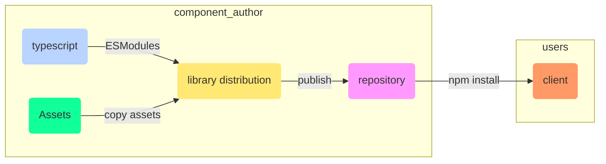

# Component Library

## Engineering Decisions

- [ ] babel vs tsc

      doesnt need babel as tsc directly compiles to favourable ES6, ES2016 .. ES2020 targets

- [ ] build system: parcel | webpack | rollup

      need something to bundle assets along with component JS
      we dont want to outsource control

## TS for Component Library. Pros

1. Reduce 3rd party dependencies
   With TS, there's absolutely no need for `proptypes` as TypeScript is in charge of type checking.
   However, use prop types only if you're using plain JS

## Tooling

### As Component Authors

You actually need to write a full Webpack configuration to generate the bundle

tsc only works with `ts -> js`. How to ship assets along with components?

### As Component Consumers

You don’t need to customize your Webpack config to use the library, this results in simpler configuration.

## Bundler Responsibility

### Rollup

which can be one of "amd", "cjs", "system", "es", "iife" or "umd"

## Use Case

Reuse components across react projects (^17 with hooks)

* add build tests to support older versions of react

### Features

* ONLY tightly coupled to react.
* Components are shipped as **ESModules**, theorytically should work with all build systmes, webpack, rollup, parcel, browserfy etc.
* Minimal final dist bundle size, exclude tests/stories
* Zero webpack config

## ToDo

- [ ] Add storybook as devDependency
- [ ] CSS preprocessor? YAGNI, CSS3 is pretty powerful in itself